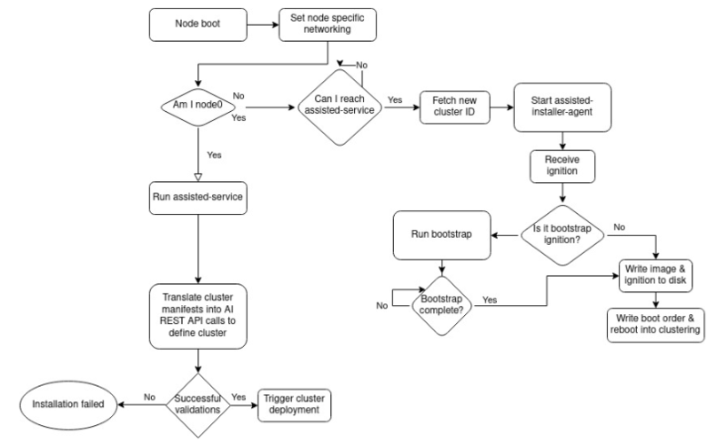

# **OpenShift Agent Installer Deployment**

There are so many ways to install OpenShift: Assisted Installer, UPI, IPI, Red Hat Advanced Cluster Management and ZTP.  However I have always longed for a single ISO image I could just boot my physical hardware and it would form a OpenShift cluster.  Well that dream is on course to become a reality with the Agent Installer a tool that can generate an ephemeral OpenShift installation image.  In the following blog I will demonstrate how to use this early incarnation of the tool.

As I stated the Agent Installer generates a single ISO image that one would use to boot all of the nodes they would want to be part of a newly deployed cluster.  However this current example may change some as the code gets developed and merged into the mainstream Openshift installer.  However if one is interested in exploring this new method the following can be a preview of what is to come.

Workflow

How to get binary

With the directory created we can move onto creating the agent cluster install resource file.  This file specifies the clusters configuration such as number of control plane and/or worker nodes, the api and ingress vip and the cluster networking.   In my example I will be deploying a 3 node compact cluster which referenced a cluster deployment named kni22:

~~~bash
$ cat << EOF > ./manifests/agent-cluster-install.yaml
apiVersion: extensions.hive.openshift.io/v1beta1
kind: AgentClusterInstall
metadata:
  name: kni22
  namespace: kni22
spec:
  apiVIP: 192.168.0.125
  ingressVIP: 192.168.0.126
  clusterDeploymentRef:
    name: kni22
  imageSetRef:
    name: openshift-v4.10.0
  networking:
    clusterNetwork:
    - cidr: 10.128.0.0/14
      hostPrefix: 23
    serviceNetwork:
    - 172.30.0.0/16
  provisionRequirements:
    controlPlaneAgents: 3
    workerAgents: 0 
  sshPublicKey: 'INSERT PUBLIC SSH KEY HERE'
EOF
~~~

Generate install-config.yaml

~~~bash
Install-config.yaml
~~~

Create image

Move image to nodes

Once the agent create image command completes we are left with a agent.iso image which is in fact our OpenShift install ISO:

~~~bash
$ ls -l ./output/
total 1073152
-rw-rw-r--. 1 bschmaus bschmaus 1098907648 May 20 08:55 agent.iso
~~~

Since the nodes I will be using to demonstrate this 3 node compact cluster are virtual machines all on the same KVM hypervisor I will go ahead and copy the agent.iso image over to that host:

~~~bash
$ scp ./output/agent.iso root@192.168.0.22:/var/lib/libvirt/images/
root@192.168.0.22's password: 
agent.iso 
~~~

With the image moved over to the hypervisor host I went ahead and ensured each virtual machine we are using (asus3-vm[1-3]) has the image set.  Further the hosts are designed boot off the ISO if the disk is empty.  We can confirm everything is ready with the following output:

~~~bash
# virsh list --all
 Id   Name        State
----------------------------
 -    asus3-vm1   shut off
 -    asus3-vm2   shut off
 -    asus3-vm3   shut off
 -    asus3-vm4   shut off
 -    asus3-vm5   shut off
 -    asus3-vm6   shut off

# virsh domblklist asus3-vm1
 Target   Source
---------------------------------------------------
 sda      /var/lib/libvirt/images/asus3-vm1.qcow2
 sdb      /var/lib/libvirt/images/agent.iso

# virsh domblklist asus3-vm2
 Target   Source
---------------------------------------------------
 sda      /var/lib/libvirt/images/asus3-vm2.qcow2
 sdb      /var/lib/libvirt/images/agent.iso

# virsh domblklist asus3-vm3
 Target   Source
---------------------------------------------------
 sda      /var/lib/libvirt/images/asus3-vm3.qcow2
 sdb      /var/lib/libvirt/images/agent.iso
~~~

Now lets go ahead and start the first virtual machine:

~~~bash
# virsh start asus3-vm1
Domain asus3-vm1 started
~~~

Once the first virtual machine is started we can switch over to the console and watch it boot up:

Deploy
