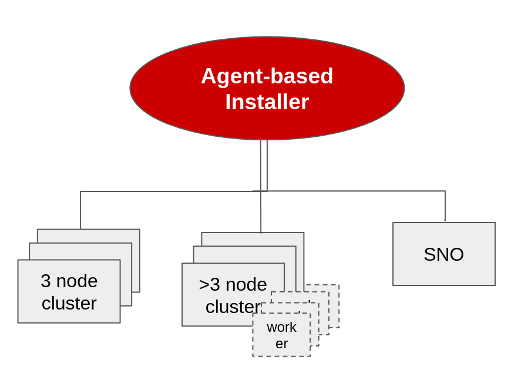
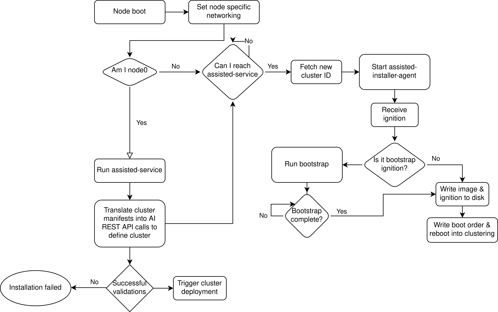
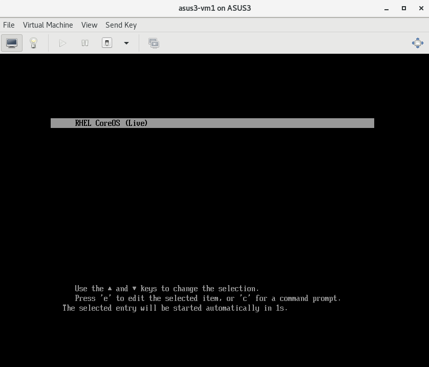

# **Meet The New Agent-Based OpenShift Installer**

With OpenShift 4.11 we are introducing a pre-release version of the [new agent-based installer for OpenShift](https://github.com/openshift/installer/tree/agent-installer) that we are adding to the official OpenShift installer. With this new <code>agent</code> subcommand, installing clusters on premise has never been so easy, while allowing as many types of designs as possible. Our aim is to provide the flexibility of [user-provided infrastructure (UPI)](https://docs.openshift.com/container-platform/4.11/installing/installing_bare_metal/installing-bare-metal.html) installs with the ease of use that the [OpenShift Assisted Installer](https://docs.openshift.com/container-platform/4.11/installing/installing_on_prem_assisted/installing-on-prem-assisted.html) offers for connected environments, while in fully disconnected or air-gapped environments. 

We have worked with users from different industries and incorporated their feedback and use cases in its design. To do this we are combining existing technologies and experience coming from the Assisted Installer and the [installer-provisioned infrastructure (IPI)](https://docs.openshift.com/container-platform/4.11/installing/installing_bare_metal_ipi/ipi-install-overview.html), among others.

## Use Cases We Are Addressing

* Quickly deploy isolated OpenShift clusters on premise of any topology.
* Install a cluster zero with OpenShift management components such as Red Hat Advanced Cluster Management for Kubernetes (ACM), GitOps, Quay, and components to support your other clusters.
* As we start with Hypershift, install the OpenShift cluster that will house the control planes for all the other clusters.

## Features Included and/or In Progress

* Create bootable images with <code>openshift-install</code> command to deploy your clusters.
* In-place bootstrap, no extra node required.
* Works in fully disconnected deployments.
* Works with a mirrored local registry.
* Supports single node OpenShift (SNO), compact 3-node clusters, and highly available topologies.
* Can be automated with third party tools.
* User-friendly interface based on the Assisted Installer.

## Limitations/Notes

 * errors in wait-for saying can be ignored
 * At least one of node needs to have static IP configuration: networkConfig or ZTP nmstateconfig
 * Conflict when both networkConfig and nmstateconfig are provided for a node
 * SNO is not completing when external api-int/ingress DNS records are missing

## Lab Demo Configuration

Throughout the rest of this blog we will be demonstrating how to use the Agent-Based Installer.  While the purpose of the installer is to address bare metal [disconnected environments](https://docs.openshift.com/container-platform/4.11/installing/disconnected_install/installing-mirroring-disconnected.htm) our lab demo configuration will consist of 3 virtual machines on a single KVM Red Hat Enterprise Linux hypervisor.  While they are virtual machines they will still demonstrate the workflow that would be experienced on regular bare metal servers.

## Getting Familiar with Agent-Based OpenShift Installer

Let us familiarize ourselves with the Agent-Based Installer workflow.   Unlike the bare metal IPI OpenShift installation there is no need for a provisioning host.  This is because one of the nodes becomes the bootstrap host early in the boot process and runs the assisted service.  The assisted service validates and confirms all hosts checking in meet the requirements and triggers a cluster deployment.   Once the cluster deployment kicks off all the nodes get their RHCOS image written to disk but only the non-bootstrap nodes reboot and begin to instantiate a cluster.  Once they come up then the original bootstrap node reboots and comes up from disk to join the cluster.  At that point the bootstrapping is complete and the cluster comes up just like any other installation method until finalized.

## Building the Binary

Now that we understand how the Agent-Based Installer works and what use cases its trying to solve lets focus on actually using it.   As of this writing the Agent-based Installer needs to be compiled from the forked installer source code.  This requirement will go away when the Agent-Based Installer becomes Generally Available as part of OpenShift.

Before we begin lets ensure we are using RHEL8 or RHEL9 on x86 architecture as our location to build the binary and have installed the packages <code>go</code>, <code>make</code> and <code>zip</code>.  Further, we will want to ensure that <code>mkisofs</code> and <code>nmstatectl</code> are installed on the system.  We also need about 5G of available disk space for the source code, compiled binary and generated images. Now lets go grab the OpenShift installer source code from Github and checkout the specific tag agent-based-installer-4.11-developer-preview:

~~~bash
$ git clone https://github.com/openshift/installer
Cloning into 'installer'...
remote: Enumerating objects: 213302, done.
remote: Counting objects: 100% (67/67), done.
remote: Compressing objects: 100% (55/55), done.
remote: Total 213302 (delta 22), reused 42 (delta 8), pack-reused 213235
Receiving objects: 100% (213302/213302), 881.35 MiB | 11.15 MiB/s, done.
Resolving deltas: 100% (139159/139159), done.
Updating files: 100% (83711/83711), done.

$ cd installer/
$ git checkout agent-based-installer-4.11-developer-preview
Note: switching to 'agent-based-installer-4.11-developer-preview'.

You are in 'detached HEAD' state. You can look around, make experimental
changes and commit them, and you can discard any commits you make in this
state without impacting any branches by switching back to a branch.

If you want to create a new branch to retain commits you create, you may
do so (now or later) by using -c with the switch command. Example:

  git switch -c <new-branch-name>

Or undo this operation with:

  git switch -

Turn off this advice by setting config variable advice.detachedHead to false

HEAD is now at 06703b2ad Merge pull request #6201 from rwsu/BUG-2114977

$ git branch
* (HEAD detached at 06703b2ad)
  master
~~~

Once we have the source code checked out we need to go ahead and build the the OpenShift install binary:

~~~bash
$ hack/build.sh
+ minimum_go_version=1.17
++ go version
++ cut -d ' ' -f 3
+ current_go_version=go1.17.7
++ version 1.17.7
++ IFS=.
++ printf '%03d%03d%03d\n' 1 17 7
++ unset IFS
++ version 1.17
++ IFS=.
++ printf '%03d%03d%03d\n' 1 17
++ unset IFS
+ '[' 001017007 -lt 001017000 ']'
+ make -C terraform all
make: Entering directory '/home/bschmaus/installer/terraform'
cd providers/alicloud; \
if [ -f main.go ]; then path="."; else path=./vendor/`grep _ tools.go|awk '{ print $2 }'|sed 's|"||g'`; fi; \
go build -ldflags "-s -w" -o ../../bin/linux_amd64/terraform-provider-alicloud "$path"; \
zip -1j ../../bin/linux_amd64/terraform-provider-alicloud.zip ../../bin/linux_amd64/terraform-provider-alicloud;
  adding: terraform-provider-alicloud (deflated 81%)
(...)
cd terraform; \
go build -ldflags "-s -w" -o ../bin/linux_amd64/terraform ./vendor/github.com/hashicorp/terraform
make: Leaving directory '/home/bschmaus/installer/terraform'
+ copy_terraform_to_mirror
++ go env GOOS
++ go env GOARCH
+ TARGET_OS_ARCH=linux_amd64
+ rm -rf '/home/bschmaus/installer/pkg/terraform/providers/mirror/*/'
+ find /home/bschmaus/installer/terraform/bin/linux_amd64/ -maxdepth 1 -name 'terraform-provider-*.zip' -exec bash -c '
      providerName="$(basename "$1" | cut -d - -f 3 | cut -d . -f 1)"
      targetOSArch="$2"
      dstDir="${PWD}/pkg/terraform/providers/mirror/openshift/local/$providerName"
      mkdir -p "$dstDir"
      echo "Copying $providerName provider to mirror"
      cp "$1" "$dstDir/terraform-provider-${providerName}_1.0.0_${targetOSArch}.zip"
    ' shell '{}' linux_amd64 ';'
Copying alicloud provider to mirror
Copying aws provider to mirror
Copying azurerm provider to mirror
Copying azurestack provider to mirror
Copying google provider to mirror
Copying ibm provider to mirror
Copying ignition provider to mirror
Copying ironic provider to mirror
Copying libvirt provider to mirror
Copying local provider to mirror
Copying nutanix provider to mirror
Copying openstack provider to mirror
Copying ovirt provider to mirror
Copying random provider to mirror
Copying time provider to mirror
Copying vsphere provider to mirror
Copying vsphereprivate provider to mirror
Copying azureprivatedns provider to mirror
+ mkdir -p /home/bschmaus/installer/pkg/terraform/providers/mirror/terraform/
+ cp /home/bschmaus/installer/terraform/bin/linux_amd64/terraform /home/bschmaus/installer/pkg/terraform/providers/mirror/terraform/
+ MODE=release
++ git rev-parse --verify 'HEAD^{commit}'
+ GIT_COMMIT=06703b2ad2fb337efce4c283acdbc5be07370de9
++ git describe --always --abbrev=40 --dirty
+ GIT_TAG=unreleased-master-6529-g06703b2ad2fb337efce4c283acdbc5be07370de9
+ DEFAULT_ARCH=amd64
+ GOFLAGS=-mod=vendor
+ LDFLAGS=' -X github.com/openshift/installer/pkg/version.Raw=unreleased-master-6529-g06703b2ad2fb337efce4c283acdbc5be07370de9 -X github.com/openshift/installer/pkg/version.Commit=06703b2ad2fb337efce4c283acdbc5be07370de9 -X github.com/openshift/installer/pkg/version.defaultArch=amd64'
+ TAGS=
+ OUTPUT=bin/openshift-install
+ export CGO_ENABLED=0
+ CGO_ENABLED=0
+ case "${MODE}" in
+ LDFLAGS=' -X github.com/openshift/installer/pkg/version.Raw=unreleased-master-6529-g06703b2ad2fb337efce4c283acdbc5be07370de9 -X github.com/openshift/installer/pkg/version.Commit=06703b2ad2fb337efce4c283acdbc5be07370de9 -X github.com/openshift/installer/pkg/version.defaultArch=amd64 -s -w'
+ TAGS=' release'
+ test '' '!=' y
+ GOOS=
+ GOARCH=
+ go generate ./data
writing assets_vfsdata.go
+ echo ' release'
+ grep -q libvirt
+ go build -mod=vendor -ldflags ' -X github.com/openshift/installer/pkg/version.Raw=unreleased-master-6529-g06703b2ad2fb337efce4c283acdbc5be07370de9 -X github.com/openshift/installer/pkg/version.Commit=06703b2ad2fb337efce4c283acdbc5be07370de9 -X github.com/openshift/installer/pkg/version.defaultArch=amd64 -s -w' -tags ' release' -o bin/openshift-install ./cmd/openshift-install
~~~

## Creating the Install-config.yaml and Agent-config.yaml

Now that we have the binary ready at <code>installer/bin/openshift-install</code> lets go ahead and create a directory that will contain the required manifests we need for our deployment that will get injected into the ISO we build:

~~~bash
$ pwd
~/installer

$ mkdir cluster-manifests
~~~

This creates the directory <code>installer/cluster-manifests</code>. With the directory created we can move onto creating the install configuration resource file.  This file specifies the clusters configuration such as number of control plane and/or worker nodes, the API and ingress VIP, physical node MAC addresses and the cluster networking. In my example I will be deploying a 3 node compact cluster which references a cluster deployment named kni22.   We will also define the image content source policy and include our cert for our registry since we are doing a disconnected installation.

~~~bash
$ cat << EOF > ./cluster-manifests/install-config.yaml
apiVersion: v1
baseDomain: schmaustech.com
compute:
- architecture: amd64
  hyperthreading: Enabled
  name: worker
  replicas: 0
controlPlane:
  architecture: amd64
  hyperthreading: Enabled
  name: master
  replicas: 3
metadata:
  name: kni22
networking:
  clusterNetwork:
  - cidr: 10.128.0.0/14
    hostPrefix: 23
  machineNetwork:
  - cidr: 192.168.0.0/24
  networkType: OVNKubernetes
  serviceNetwork:
  - 172.30.0.0/16
platform:
  baremetal:
    hosts:
      - name: asus3-vm1
        role: master
        bootMACAddress: 52:54:00:e7:05:72
      - name: asus3-vm2
        role: master
        bootMACAddress: 52:54:00:95:fd:f3
      - name: asus3-vm3
        role: master
        bootMACAddress: 52:54:00:e8:b9:18
    apiVIP: "192.168.0.125"
    ingressVIP: "192.168.0.126"
pullSecret: '{ "auths": { "provisioning.schmaustech.com:5000": {"auth": "ZHVtbXk6ZHVtbXk=","email": "bschmaus@schmaustech.com" } } }'
sshKey: 'ssh-rsa AAAAB3NzaC1yc2EAAAADAQABAAABgQCoy2/8SC8K+9PDNOqeNady8xck4AgXqQkf0uusYfDJ8IS4pFh178AVkz2sz3GSbU41CMxO6IhyQS4Rga3Ft/VlW6ZAW7icz3mw6IrLRacAAeY1BlfxfupQL/yHjKSZRze9vDjfQ9UDqlHF/II779Kz5yRKYqXsCt+wYESU7DzdPuGgbEKXrwi9GrxuXqbRZOz5994dQW7bHRTwuRmF9KzU7gMtMCah+RskLzE46fc2e4zD1AKaQFaEm4aGbJjQkELfcekrE/VH3i35cBUDacGcUYmUEaco3c/+phkNP4Iblz4AiDcN/TpjlhbU3Mbx8ln6W4aaYIyC4EVMfgvkRVS1xzXcHexs1fox724J07M1nhy+YxvaOYorQLvXMGhcBc9Z2Au2GA5qAr5hr96AHgu3600qeji0nMM/0HoiEVbxNWfkj4kAegbItUEVBAWjjpkncbe5Ph9nF2DsBrrg4TsJIplYQ+lGewzLTm/cZ1DnIMZvTY/Vnimh7qa9aRrpMB0= bschmaus@provisioning'
imageContentSources:
- mirrors:
  - provisioning.schmaustech.com:5000/ocp4/openshift4
  source: quay.io/openshift-release-dev/ocp-v4.0-art-dev
- mirrors:
  - provisioning.schmaustech.com:5000/ocp4/openshift4
  source: registry.svc.ci.openshift.org/ocp/release
additionalTrustBundle: |
  -----BEGIN CERTIFICATE-----
  MIIGKDCCBBCgAwIBAgIUVu+F6PrAXwxVfPs4D0KQA3+50y4wDQYJKoZIhvcNAQEL
  BQAwgYQxCzAJBgNVBAYTAlVTMRYwFAYDVQQIDA1Ob3J0aENhcm9saW5hMRAwDgYD
  VQQHDAdSYWxlaWdoMRAwDgYDVQQKDAdSZWQgSGF0MRIwEAYDVQQLDAlNYXJrZXRp
  bmcxJTAjBgNVBAMMHHByb3Zpc2lvbmluZy5zY2htYXVzdGVjaC5jb20wHhcNMjIw
  MjE2MjAzNjQwWhcNMjMwMjE2MjAzNjQwWjCBhDELMAkGA1UEBhMCVVMxFjAUBgNV
  BAgMDU5vcnRoQ2Fyb2xpbmExEDAOBgNVBAcMB1JhbGVpZ2gxEDAOBgNVBAoMB1Jl
  ZCBIYXQxEjAQBgNVBAsMCU1hcmtldGluZzElMCMGA1UEAwwccHJvdmlzaW9uaW5n
  LnNjaG1hdXN0ZWNoLmNvbTCCAiIwDQYJKoZIhvcNAQEBBQADggIPADCCAgoCggIB
  AKfEtYL50jb7DYOMn5gF2PCfnn/ah/m3K/cHXFzu3pjeZ8rlsO9yV+u+TYGmQnMK
  obfKUB5F2twMkGEdX3cHyRvo0YiNVzlS9HEt8A1MejlLBGaNvLXLKCpy5eC1tVwh
  51Nj4pscmACd1WNla+KzYqUURRW90SEEN6jNgoabuip2vXLRZLYqDG8uAZ+fFLnz
  Hz0/pbR0bv1mvA0eppLgvGS7DBQdl+LoNg9ZZj/0CgveCmjMFH+5Dw9hMIbPMEpX
  zrG8DgzgME5jIJYzsMu7aOBmQgappfHoU25RC87/vDfGJI65/bQESo7mdLnSmccz
  ADssp4SVnWPOfWotWNalh7hN64Xp4lbf4Kz2ESvQXU+oOwxhlEZhhJJ8KP7Ei6AL
  4mvXSWgXB69GQHwRJ3bi/AdaQC8LcaIRPm+Toy+UUgfNxtJLyi55lsIYjpig7ndW
  vg9kEQUAWz9pr95hn2l9jodGmAcli2s4UDbvhW464NjaVrf8vttpcgxvL3KZBSEZ
  JjkCiQMy5n+BEDZJeiMGDz4guiRk7QW9WrKw8vhPRhKo4ga8kS4bBd+Y1FXrhfiP
  n5V72sSZbPyi66HXGVJUehsbxynfSebaT0ox29j4JyypvzMgMhUCh0tINHqGhGxy
  Rrm67cy9i20JlOXJ9pIXA8REg9avlH4o0WZ1pC63MTiRAgMBAAGjgY8wgYwwHQYD
  VR0OBBYEFFVYOJ5T/qQL71IYyy9iA9CVME9zMB8GA1UdIwQYMBaAFFVYOJ5T/qQL
  71IYyy9iA9CVME9zMA8GA1UdEwEB/wQFMAMBAf8wJwYDVR0RBCAwHoIccHJvdmlz
  aW9uaW5nLnNjaG1hdXN0ZWNoLmNvbTAQBgNVHSAECTAHMAUGAyoDBDANBgkqhkiG
  9w0BAQsFAAOCAgEAoTmLrWsAA0vTq5ALmDa4HBE+qoygqgU5MxDpWZoObGXmo+TK
  se51NPaMyCt3dMsDY8jeDHchr4tVr272J3jDK6ORhQ5v43qJYgAN9Ilnu165QtqD
  WICnXQvnb8PN0zw0ilm9qB6gSwo+1dvHTR5BJ7B3au7WarpUeC8CclIAzEJjSwEo
  Qtdown9cFyC+bShFvL+jZCe7IuWV/AQDZGodNgTAWX0frUklZBcMyJ3LbazCMpb/
  INvO0D1ZrFt8U1QujCKY+2ba7cxnuNwzrJwugQU9FSYrsGHQCthOH6tNwxhuW7Rh
  UqIFLwS25nrfYiu+9EiXXGvjvymCGAwX4d4vGFAJsdPZgkDa3QuW6dq3IF4hkT9v
  loe/LSt9Dr7l9baqnVgg67qc/99T56uI5tiCu8UjJQpHhDDhoJJRnwOOEdStk9hR
  k8niIe373gQ7RBu/jJ0gt/h8CzKRbuRAIS7BTmvOPUe1pGjWh8ZaWyMdQE9/k8cQ
  hHXB0vjqxw15+DPso7SvxWM2Hzhdj5E/cDlXlQfkEEzk6Qk9+I4WY71qsRdguHZl
  q8YYyrzZ5ZiHHHIFfKDZ4Tr50buqLG1Eh34jukA+La7kdOjQhMF4jjdWHJdg/fpn
  wo0DwOKYVO1M1IUl162LHGJDGUr0RUfriX4pKsdg2LvaxuBeNA6HI3QQO+c=
  -----END CERTIFICATE-----
EOF
~~~

The next configuration file we need to create is the agent configuration resource file.   This file will contain the details of the actual hosts in relation to their networking configuration.   Looking close we can see that for each host we define the interfac, mac address, ipaddress if static and a DNS resolver and routes.   The configuration is very similar to a NMState configuration.  However one item that is a bit different is the rendezvousIP address.   This is the ipaddress of the host that will become the temporary bootstrap node while the cluster is installing.  This ipaddress shoule match one of the other nodes whether they are using a static ipaddress or a dhcp reservation ipaddress:

~~~bash
$ cat << EOF > ./cluster-manifests/agent-config.yaml
kind: AgentConfig
metadata:
  name: kni22
spec:
  rendezvousIP: 192.168.0.116
  hosts:
    - hostname: asus3-vm1
      interfaces:
       - name: enp2s0
         macAddress: 52:54:00:e7:05:72
      networkConfig:
        interfaces:
          - name: enp2s0
            type: ethernet
            state: up
            mac-address: 52:54:00:e7:05:72
            ipv4:
              enabled: true
              address:
                - ip: 192.168.0.116
                  prefix-length: 23
              dhcp: false
        dns-resolver:
          config:
            server:
              - 192.168.0.10
        routes:
          config:
            - destination: 0.0.0.0/0
              next-hop-address: 192.168.0.1
              next-hop-interface: enp2s0
              table-id: 254
    - hostname: asus3-vm2
      interfaces:
       - name: enp2s0
         macAddress: 52:54:00:95:fd:f3
      networkConfig:
        interfaces:
          - name: enp2s0
            type: ethernet
            state: up
            mac-address: 52:54:00:95:fd:f3
            ipv4:
              enabled: true
              address:
                - ip: 192.168.0.117
                  prefix-length: 23
              dhcp: false
        dns-resolver:
          config:
            server:
              - 192.168.0.10
        routes:
          config:
            - destination: 0.0.0.0/0
              next-hop-address: 192.168.0.1
              next-hop-interface: enp2s0
              table-id: 254
    - hostname: asus3-vm3
      interfaces:
       - name: enp2s0
         macAddress: 52:54:00:e8:b9:18
      networkConfig:
        interfaces:
          - name: enp2s0
            type: ethernet
            state: up
            mac-address: 52:54:00:e8:b9:18
            ipv4:
              enabled: true
              address:
                - ip: 192.168.0.118
                  prefix-length: 23
              dhcp: false
        dns-resolver:
          config:
            server:
              - 192.168.0.10
        routes:
          config:
            - destination: 0.0.0.0/0
              next-hop-address: 192.168.0.1
              next-hop-interface: enp2s0
              table-id: 254
EOF
~~~

At this point we have now created two configuration files: the install-config.yaml and the agent-config.yaml.  Both of which are under the cluster-manifests directory:

~~~bash
$ ls -1 cluster-manifests/
agent-config.yaml
install-config.yaml
~~~

## Building the Agent.iso Image

One more step we need to execute before creating our image is to set our image release override to ensure we are deploying the version of OpenShift we want to deploy.  In my example my local disconnected registry contains the following OpenShift release 4.11.0-rc.7.  So we will want to set the override to that version by executing the following:

~~~bash
export VERSION="4.11.0"
export OPENSHIFT_RELEASE_IMAGE="registry.svc.ci.openshift.org/ocp/release:$VERSION"
export LOCAL_REG='provisioning.schmaustech.com:5000'
export export LOCAL_REPO='ocp4/openshift4'
export OPENSHIFT_INSTALL_RELEASE_IMAGE_OVERRIDE=${LOCAL_REG}/${LOCAL_REPO}:${VERSION}
~~~

We are now ready to use the Openshift install binary we compiled earlier with the Agent Installer code to generate our ephemeral OpenShift ISO.   We do this by issuing the following command which introduces the agent option.  This in turn will read in the manifest details we generated and download the corresponding RHCOS image and then inject our details into the image writing out a file called agent.iso:

~~~bash
$ bin/openshift-install agent create image --log-level debug --dir cluster-manifests
WARNING Found override for release image. Please be warned, this is not advised 
WARNING Found override for release image. Please be warned, this is not advised 
INFO[0000] Start configuring static network for 3 hosts  pkg=manifests
INFO[0000] Adding NMConnection file <enp2s0.nmconnection>  pkg=manifests
INFO[0001] Adding NMConnection file <enp2s0.nmconnection>  pkg=manifests
INFO[0001] Adding NMConnection file <enp2s0.nmconnection>  pkg=manifests
INFO[0001] Extracting base ISO from release payload     
INFO Consuming Install Config from target directory 
INFO Consuming Agent Config from target directory 

~~~

Once the agent create image command completes we are left with a agent.iso image and an auth directory that containers kubeconfig:

~~~bash
$ ls -1 cluster-manifests/
agent.iso
auth
$ ls -1 cluster-manifests/auth/
kubeconfig
~~~

## Staging the Image on Nodes

Since the nodes I will be using to demonstrate this 3 node compact cluster are virtual machines all on the same KVM hypervisor I will go ahead and copy the agent.iso image over to that host:

~~~bash
$ scp ./cluster-manifests/agent.iso root@192.168.0.22:/var/lib/libvirt/images/
root@192.168.0.22's password: 
agent.iso 
~~~

With the image moved over, I logged into the hypervisor host and ensured each virtual machine we are using (asus3-vm[1-3]) has the image set.  Further the hosts are designed boot off the ISO if the disk is blank.  We can confirm everything is ready with the following output:

~~~bash
# virsh list --all
 Id   Name        State
----------------------------
 -    asus3-vm1   shut off
 -    asus3-vm2   shut off
 -    asus3-vm3   shut off
 -    asus3-vm4   shut off
 -    asus3-vm5   shut off
 -    asus3-vm6   shut off

# virsh domblklist asus3-vm1
 Target   Source
---------------------------------------------------
 sda      /var/lib/libvirt/images/asus3-vm1.qcow2
 sdb      /var/lib/libvirt/images/agent.iso

# virsh domblklist asus3-vm2
 Target   Source
---------------------------------------------------
 sda      /var/lib/libvirt/images/asus3-vm2.qcow2
 sdb      /var/lib/libvirt/images/agent.iso

# virsh domblklist asus3-vm3
 Target   Source
---------------------------------------------------
 sda      /var/lib/libvirt/images/asus3-vm3.qcow2
 sdb      /var/lib/libvirt/images/agent.iso
~~~

## Running and Watching the Deployment

Now lets go ahead and start the virtual machines all at the same time from the hypervisor host:

~~~bash
# virsh start asus3-vm1
Domain asus3-vm1 started

# virsh start asus3-vm2
Domain asus3-vm1 started

# virsh start asus3-vm3
Domain asus3-vm1 started
~~~

If we switch over to the console of one of the virtual machines using virt-manager we should see the CoreOSLive boot screen:

With the nodes booting we can return to the installer directory where we built the agent image and watch the installation continue. To do this we need to first export the <code>kubeconfig</code> file and then issue the command <code>openshift-install agent</code> with the <code>wait-for install-complete</code> switch:

~~~bash
$ pwd
~/installer

$ export KUBECONFIG=/home/bschmaus/installer/cluster-manifests/auth/kubeconfig

$ bin/openshift-install agent wait-for install-complete --dir cluster-manifests
INFO Waiting for cluster install to initialize. Sleeping for 30 seconds 
INFO Waiting for cluster install to initialize. Sleeping for 30 seconds 
INFO Waiting for cluster install to initialize. Sleeping for 30 seconds 
INFO Checking for validation failures ---------------------------------------------- 
ERROR Validation failure found for asus3-vm1        category=network label=Belongs to majority connected group message=No connectivity to the majority of hosts in the cluster
ERROR Validation failure found for asus3-vm1        category=network label=DNS wildcard not configured message=Parse error for domain name resolutions result
ERROR Validation failure found for asus3-vm1        category=network label=NTP synchronization message=Host couldn't synchronize with any NTP server
ERROR Validation failure found for asus3-vm2        category=network label=Belongs to majority connected group message=No connectivity to the majority of hosts in the cluster
ERROR Validation failure found for asus3-vm2        category=network label=DNS wildcard not configured message=Parse error for domain name resolutions result
ERROR Validation failure found for asus3-vm2        category=network label=NTP synchronization message=Host couldn't synchronize with any NTP server
ERROR Validation failure found for asus3-vm3        category=network label=Belongs to majority connected group message=No connectivity to the majority of hosts in the cluster
ERROR Validation failure found for asus3-vm3        category=network label=DNS wildcard not configured message=Parse error for domain name resolutions result
ERROR Validation failure found for asus3-vm3        category=network label=NTP synchronization message=Host couldn't synchronize with any NTP server
ERROR Validation failure found for cluster          category=hosts-data label=all-hosts-are-ready-to-install message=The cluster has hosts that are not ready to install.
INFO Checking for validation failures ---------------------------------------------- 
ERROR Validation failure found for asus3-vm1        category=network label=Belongs to majority connected group message=No connectivity to the majority of hosts in the cluster
ERROR Validation failure found for asus3-vm2        category=network label=Belongs to majority connected group message=No connectivity to the majority of hosts in the cluster
ERROR Validation failure found for asus3-vm3        category=network label=Belongs to majority connected group message=No connectivity to the majority of hosts in the cluster
ERROR Validation failure found for cluster          category=hosts-data label=all-hosts-are-ready-to-install message=The cluster has hosts that are not ready to install.
INFO Checking for validation failures ---------------------------------------------- 
ERROR Validation failure found for cluster          category=hosts-data label=all-hosts-are-ready-to-install message=The cluster has hosts that are not ready to install.
INFO Pre-installation validations are OK          
INFO Cluster is ready for install                 
INFO Host asus3-vm1: updated status from insufficient to known (Host is ready to be installed) 
INFO Preparing cluster for installation           
INFO Host asus3-vm3: updated status from known to preparing-for-installation (Host finished successfully to prepare for installation) 
INFO Host asus3-vm1: New image status quay.io/openshift-release-dev/ocp-v4.0-art-dev@sha256:b6f2a69fdc1a0844565320fc51316aa79ad6d4661326b30fa606123476c3d9f7. result: success. time: 0.83 seconds; size: 378.98 Megabytes; download rate: 479.70 MBps 
INFO Host asus3-vm1: updated status from preparing-for-installation to preparing-successful (Host finished successfully to prepare for installation) 
INFO Cluster installation in progress             
INFO Host asus3-vm3: updated status from preparing-successful to installing (Installation is in progress) 
INFO Host: asus3-vm2, reached installation stage Writing image to disk 
INFO Host: asus3-vm1, reached installation stage Writing image to disk 
INFO Host: asus3-vm2, reached installation stage Writing image to disk: 24% 
INFO Host: asus3-vm2, reached installation stage Writing image to disk: 30% 
INFO Host: asus3-vm3, reached installation stage Writing image to disk: 45% 
INFO Host: asus3-vm1, reached installation stage Writing image to disk: 43% 
INFO Host: asus3-vm1, reached installation stage Writing image to disk: 57% 
INFO Host: asus3-vm1, reached installation stage Writing image to disk: 62% 
INFO Host: asus3-vm1, reached installation stage Writing image to disk: 72% 
INFO Host: asus3-vm1, reached installation stage Writing image to disk: 77% 
INFO Host: asus3-vm1, reached installation stage Writing image to disk: 85% 
INFO Host: asus3-vm2, reached installation stage Writing image to disk: 100% 
INFO Host: asus3-vm2, reached installation stage Rebooting 
INFO Host: asus3-vm1, reached installation stage Waiting for control plane: Waiting for masters to join bootstrap control plane 
INFO Cluster Kube API Initialized                 
INFO Host: asus3-vm2, reached installation stage Configuring 
INFO Host: asus3-vm2, reached installation stage Joined 
INFO Host: asus3-vm1, reached installation stage Waiting for bootkube 
INFO Host: asus3-vm3, reached installation stage Done 
INFO Host: asus3-vm1, reached installation stage Waiting for controller: waiting for controller pod ready event 
INFO Bootstrap configMap status is complete       
INFO cluster bootstrap is complete                
INFO Cluster is installed                         
INFO Install complete!                            
INFO To access the cluster as the system:admin user when using 'oc', run 
INFO     export KUBECONFIG=/home/bschmaus/installer/cluster-manifests/auth/kubeconfig 
INFO Access the OpenShift web-console here: https://console-openshift-console.apps.kni22.schmaustech.com 
~~~

Once the cluster installation has completed we can run a few commands to validate that indeed the cluster is up and operational:

~~~bash
$ oc get nodes
NAME        STATUS   ROLES           AGE   VERSION
asus3-vm1   Ready    master,worker   16m   v1.24.0+9546431
asus3-vm2   Ready    master,worker   30m   v1.24.0+9546431
asus3-vm3   Ready    master,worker   30m   v1.24.0+9546431

$ oc get co
NAME                                       VERSION       AVAILABLE   PROGRESSING   DEGRADED   SINCE   MESSAGE
authentication                             4.11.0        True        False         False      4m38s   
baremetal                                  4.11.0        True        False         False      28m     
cloud-controller-manager                   4.11.0        True        False         False      30m     
cloud-credential                           4.11.0        True        False         False      33m     
cluster-autoscaler                         4.11.0        True        False         False      28m     
config-operator                            4.11.0        True        False         False      29m     
console                                    4.11.0        True        False         False      11m     
csi-snapshot-controller                    4.11.0        True        False         False      29m     
dns                                        4.11.0        True        False         False      29m     
etcd                                       4.11.0        True        False         False      27m     
image-registry                             4.11.0        True        False         False      14m     
ingress                                    4.11.0        True        False         False      20m     
insights                                   4.11.0        True        False         False      52s     
kube-apiserver                             4.11.0        True        False         False      25m     
kube-controller-manager                    4.11.0        True        False         False      26m     
kube-scheduler                             4.11.0        True        False         False      25m     
kube-storage-version-migrator              4.11.0        True        False         False      29m     
machine-api                                4.11.0        True        False         False      25m     
machine-approver                           4.11.0        True        False         False      28m     
machine-config                             4.11.0        True        False         False      28m     
marketplace                                4.11.0        True        False         False      29m     
monitoring                                 4.11.0        True        False         False      13m     
network                                    4.11.0        True        False         False      30m     
node-tuning                                4.11.0        True        False         False      28m     
openshift-apiserver                        4.11.0        True        False         False      14m     
openshift-controller-manager               4.11.0        True        False         False      25m     
openshift-samples                          4.11.0        True        False         False      20m     
operator-lifecycle-manager                 4.11.0        True        False         False      29m     
operator-lifecycle-manager-catalog         4.11.0        True        False         False      29m     
operator-lifecycle-manager-packageserver   4.11.0        True        False         False      23m     
service-ca                                 4.11.0        True        False         False      29m     
storage                                    4.11.0        True        False         False      29m     
~~~

## Setting KubeAdmin Password

Now one thing we noticed is that the kubeadmin password is not available from the log output.   This is because this development preview of Agent-Based Installer does not provide that yet.  However we can go ahead and reset the kubeadmin password with the following procedure. Ensure that golang is installed before procceeding.  Then start with creating an empty directory called kuberotate:

~~~bash
$ mkdir ~/kuberotate
$ cd ~/kuberotate
~~~

Next lets generate the kubeadmin-rotate.go file with the following source code:

~~~bash
$ cat << EOF > ./kubeadmin-rotate.go 
package main

import (
	"fmt"
	"crypto/rand"
	"golang.org/x/crypto/bcrypt"
	b64 "encoding/base64"
	"math/big"
)

// generateRandomPasswordHash generates a hash of a random ASCII password
// 5char-5char-5char-5char
func generateRandomPasswordHash(length int) (string, string, error) {
	const (
		lowerLetters = "abcdefghijkmnopqrstuvwxyz"
		upperLetters = "ABCDEFGHIJKLMNPQRSTUVWXYZ"
		digits       = "23456789"
		all          = lowerLetters + upperLetters + digits
	)
	var password string
	for i := 0; i < length; i++ {
		n, err := rand.Int(rand.Reader, big.NewInt(int64(len(all))))
		if err != nil {
			return "", "", err
		}
		newchar := string(all[n.Int64()])
		if password == "" {
			password = newchar
		}
		if i < length-1 {
			n, err = rand.Int(rand.Reader, big.NewInt(int64(len(password)+1)))
			if err != nil {
				return "", "",err
			}
			j := n.Int64()
			password = password[0:j] + newchar + password[j:]
		}
	}
	pw := []rune(password)
	for _, replace := range []int{5, 11, 17} {
		pw[replace] = '-'
	}
	
	bytes, err := bcrypt.GenerateFromPassword([]byte(string(pw)), bcrypt.DefaultCost)
	if err != nil {
		return "", "",err
	}

	return string(pw), string(bytes), nil
}

func main() {
        password, hash, err := generateRandomPasswordHash(23)
        
        if err != nil {
           fmt.Println(err.Error())
           return
        }
	fmt.Printf("Actual Password: %s\n", password)
	fmt.Printf("Hashed Password: %s\n", hash)
	fmt.Printf("Data to Change in Secret: %s\n", b64.StdEncoding.EncodeToString([]byte(hash)))
}
EOF 
~~~

Next lets go ahead and initialize our go project with the go mod init command:

~~~bash
$ go mod init kubeadmin-rotate.go 
go: creating new go.mod: module kubeadmin-rotate.go
go: to add module requirements and sums:
	go mod tidy
~~~

With the project initialized lets go ahead and pull in the module dependencies by executing a go mod tidy which will pull in the bcrypt module:

~~~bash
$ go mod tidy
go: finding module for package golang.org/x/crypto/bcrypt
go: downloading golang.org/x/crypto v0.0.0-20220722155217-630584e8d5aa
go: found golang.org/x/crypto/bcrypt in golang.org/x/crypto v0.0.0-20220722155217-630584e8d5aa
~~~

And finally since I just want to run the program instead of compile it I will just run a go run kubeadmin-rotate.go which will print out the password, a hashed password and a base64 encoded version of the hashed password:

~~~bash
$ go run kubeadmin-rotate.go
Actual Password: XiRng-TKIRI-cFTgu-IVPAZ
Hashed Password: $2a$10$JCjJ85I47HgNYsJku6JrZe.b9ds40z6URdoDKUpBfC9sNAoeZN3mm
Data to Change in Secret: JDJhJDEwJEpDako4NUk0N0hnTllzSmt1NkpyWmUuYjlkczQwejZVUmRvREtVcEJmQzlzTkFvZVpOM21t
~~~

The last step is to patch the kubeadmin secret with the hashed password that was base64 encoded from the Data to Change in Secret line above:

~~~bash
$ oc patch secret -n kube-system kubeadmin --type json -p '[{"op": "replace", "path": "/data/kubeadmin", "value": "JDJhJDEwJEpDako4NUk0N0hnTllzSmt1NkpyWmUuYjlkczQwejZVUmRvREtVcEJmQzlzTkFvZVpOM21t"}]' 
secret/kubeadmin patched
~~~

And now we should be able to login to the OpenShift Console with our newly reset kubeadmin password.

## Final Thoughts 

Hopefully this blog provides an early glimpse into the the ease of installation of disconnected clusters on bare metal when using the new Agent-Based Installer.  In future releases when it goes GA we plan to provide additional improvements and enhancements, such as a graphical user interface.
